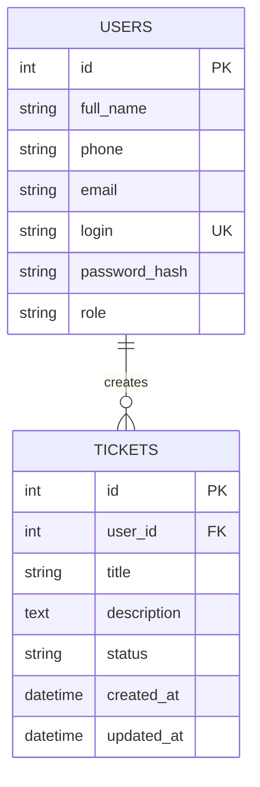

# ER-диаграмма

```mermaid
erDiagram
    USERS ||--o{ TICKETS : creates
    USERS {
        int id PK
        string full_name
        string phone
        string email
        string login UK
        string password_hash
        string role
    }
    TICKETS {
        int id PK
        int user_id FK
        string title
        text description
        string status
        datetime created_at
        datetime updated_at
    }
```
